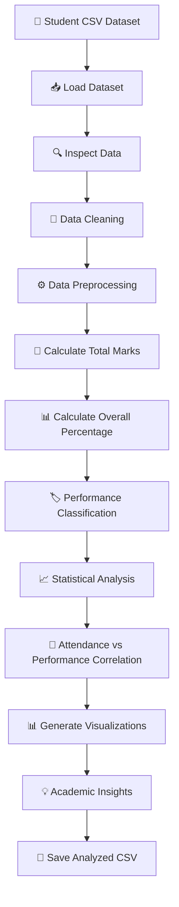
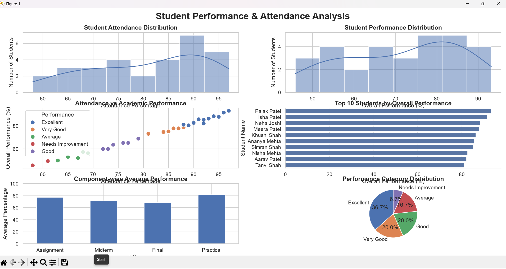
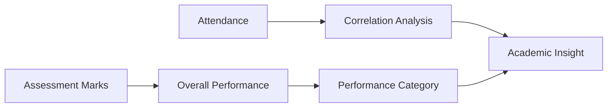

# 📊 Student Performance & Attendance Analyzer

> **Python for Data Science --- GTU PBL Micro Project**

A simple and practical data-analysis project that helps teachers and
academic coordinators analyze **student attendance, assessment
performance, overall results, and performance patterns** using Python.

The project demonstrates the complete basic data-science workflow:

**CSV Dataset → Data Cleaning → Data Preprocessing → Statistical
Analysis → Performance Classification → Correlation Analysis →
Visualization → Insights**

------------------------------------------------------------------------

## 🏷️ Project Overview

Teachers often have student marks and attendance data in spreadsheets or
CSV files. Manually calculating overall performance, identifying
students who need attention, finding top performers, and understanding
the relationship between attendance and marks can be time-consuming.

This project automates that analysis using:

-   🐍 Python
-   🐼 Pandas
-   🔢 NumPy
-   📊 Matplotlib
-   📈 Seaborn

The program reads a student dataset, cleans the data, calculates overall
performance percentages, classifies students, performs statistical
analysis, and generates six visualizations.

------------------------------------------------------------------------

## 🎯 Problem Statement

> **How can student attendance and academic performance data be analyzed
> automatically to identify performance patterns, top-performing
> students, and students who may require academic attention?**

------------------------------------------------------------------------

## 💡 Objectives

1.  Analyze student attendance data.
2.  Clean missing and duplicate records.
3.  Calculate total and overall performance percentage.
4.  Classify students based on their performance.
5.  Calculate pass/fail statistics.
6.  Identify the top 10 students.
7.  Identify students requiring attention.
8.  Compare performance across assessment components.
9.  Analyze the relationship between attendance and academic
    performance.
10. Present the results using clear visualizations.

------------------------------------------------------------------------

## 🧰 Technologies Used

  Technology                Purpose
  ------------------------- -----------------------------------------------------
  🐍 Python                 Core programming language
  🐼 Pandas                 Data loading, cleaning and analysis
  🔢 NumPy                  Numerical operations and conditional classification
  📊 Matplotlib             Data visualization
  📈 Seaborn                Statistical visualization
  📄 CSV                    Dataset storage
  💻 VS Code / Python IDE   Development environment

------------------------------------------------------------------------

## 📂 Project Structure

``` text
Student-Performance-Attendance-Analyzer/
│
├── student_performance_analyzer.py
├── student_performance.csv
├── analyzed_student_performance.csv
├── README.md
│
└── docs/
    └── dashboard.png
```

### File Description

-   `student_performance_analyzer.py` --- Main Python program.
-   `student_performance.csv` --- Input student dataset.
-   `analyzed_student_performance.csv` --- Generated dataset containing
    calculated fields.
-   `README.md` --- Project documentation.
-   `docs/dashboard.png` --- Screenshot of the generated visualization
    dashboard.

> **Tip:** Save the screenshot of your final six-graph output as
> `docs/dashboard.png` so GitHub displays it in the README.

------------------------------------------------------------------------

# 🔄 System Workflow



------------------------------------------------------------------------

# 📋 Dataset

The input CSV contains the following fields:

  Column         Description
  -------------- -----------------------------
  `Student_ID`   Unique student identifier
  `Name`         Student name
  `Attendance`   Attendance percentage
  `Assignment`   Assignment marks
  `Midterm`      Midterm examination marks
  `Final`        Final examination marks
  `Practical`    Practical examination marks

### Assessment Maximum Marks

  Component      Maximum Marks
  ------------ ---------------
  Assignment                20
  Midterm                   50
  Final                    100
  Practical                 20
  **Total**            **190**

------------------------------------------------------------------------

# 🧮 How Performance Is Calculated

Because each assessment component has a different maximum mark, the
project does **not** simply calculate the average of the four raw marks.

Instead:

``` text
Overall Performance (%) =
(Total Obtained Marks / Total Maximum Marks) × 100
```

For example:

``` text
Assignment = 18 / 20
Midterm    = 42 / 50
Final      = 78 / 100
Practical  = 18 / 20

Total Obtained = 156
Total Maximum  = 190

Overall Performance =
(156 / 190) × 100

= 82.11%
```

This student would be classified as **Excellent**.

------------------------------------------------------------------------

# 🏷️ Performance Classification

The project uses the following performance categories:

    Overall Percentage Category
  -------------------- ----------------------
                 ≥ 80% 🟢 Excellent
            70--79.99% 🔵 Very Good
            60--69.99% 🟡 Good
            50--59.99% 🟠 Average
                \< 50% 🔴 Needs Improvement

### Result Classification

``` text
Overall Performance ≥ 40%
        ↓
      PASS

Overall Performance < 40%
        ↓
      FAIL
```

------------------------------------------------------------------------

# 🧹 Data Cleaning

Before analysis, the program performs basic preprocessing:

### 1. Missing-value detection

``` python
df.isnull().sum()
```

### 2. Duplicate detection

``` python
df.duplicated().sum()
```

### 3. Duplicate removal

``` python
df = df.drop_duplicates()
```

### 4. Numeric conversion

Invalid numeric values are converted to missing values and then handled.

### 5. Missing-value treatment

Missing numerical values are filled using the **median** of the
corresponding column.

### 6. Range validation

-   Attendance is restricted to `0–100`.
-   Marks cannot be negative.

------------------------------------------------------------------------

# 📊 Visualizations

The project generates a six-chart analysis dashboard.

## 1️⃣ Student Attendance Distribution

Shows how attendance percentages are distributed among students.

## 2️⃣ Student Performance Distribution

Shows the distribution of overall performance percentages.

## 3️⃣ Attendance vs Academic Performance

A scatter plot used to examine the relationship between attendance and
overall performance.

## 4️⃣ Top 10 Students

A horizontal bar chart showing the ten students with the highest overall
performance.

## 5️⃣ Component-wise Average Performance

Compares average percentage performance in:

-   Assignment
-   Midterm
-   Final
-   Practical

## 6️⃣ Performance Category Distribution

A pie chart showing the proportion of students in each performance
category.

------------------------------------------------------------------------

## 🖼️ Project Dashboard

After running the program, save the generated six-graph window as:

``` text
docs/dashboard.png
```

Then GitHub will display it here:



> If the image does not appear, make sure the screenshot is saved at
> exactly `docs/dashboard.png`.

------------------------------------------------------------------------

# 📈 Example Analysis Flow



The analysis combines attendance and assessment data to provide a simple
academic performance overview.

------------------------------------------------------------------------

# 📌 Key Outputs

The program displays:

### 📊 Class Summary

-   Total number of students
-   Class average
-   Average attendance
-   Highest performance
-   Lowest performance

### 📝 Result Analysis

-   Number of passed students
-   Number of failed students
-   Pass percentage
-   Fail percentage

### 🏆 Top Performers

The top 10 students are displayed according to overall performance.

### ⚠️ Students Requiring Attention

A student is flagged when:

``` text
Attendance < 75%
        OR
Performance < 50%
```

### 🔗 Correlation

The program calculates the Pearson correlation between:

``` text
Attendance
     ↕
Overall Performance
```

A positive correlation indicates that the two variables move together in
the analyzed dataset. Correlation alone does not establish causation.

------------------------------------------------------------------------

# 🚀 Installation

## Step 1 --- Install Python

Install Python 3.x and verify:

``` bash
python --version
```

------------------------------------------------------------------------

## Step 2 --- Clone the Repository

``` bash
git clone <YOUR-GITHUB-REPOSITORY-URL>
cd Student-Performance-Attendance-Analyzer
```

------------------------------------------------------------------------

## Step 3 --- Install Required Libraries

``` bash
pip install pandas numpy matplotlib seaborn
```

------------------------------------------------------------------------

## Step 4 --- Check Project Files

Make sure the project contains:

``` text
student_performance_analyzer.py
student_performance.csv
```

------------------------------------------------------------------------

## Step 5 --- Run the Project

``` bash
python student_performance_analyzer.py
```

The program will:

1.  Load the CSV file.
2.  Clean the data.
3.  Calculate performance.
4.  Display statistical results.
5.  Generate the visualization dashboard.
6.  Save the analyzed dataset.

------------------------------------------------------------------------

# 💾 Output File

After successful execution, the program creates:

``` text
analyzed_student_performance.csv
```

This file contains the original data plus calculated fields such as:

``` text
Total_Marks
Average_Marks
Performance
Result
Attendance_Status
Requires_Attention
```

------------------------------------------------------------------------

# 🧠 Data Science Concepts Demonstrated

This project demonstrates several important Python for Data Science
concepts:

``` text
                 PYTHON FOR DATA SCIENCE
                         │
        ┌────────────────┼────────────────┐
        ↓                ↓                ↓
   Data Handling    Data Analysis    Visualization
        │                │                │
      Pandas          Statistics      Matplotlib
        │                │                │
      NumPy         Correlation        Seaborn
        │                │                │
        └────────────────┼────────────────┘
                         ↓
                   Data Insights
```

### Concepts Used

-   CSV data handling
-   DataFrames
-   Data cleaning
-   Missing-value handling
-   Duplicate removal
-   Data validation
-   Descriptive statistics
-   Mean and percentage calculations
-   Conditional classification
-   Correlation analysis
-   Data visualization
-   Exporting processed data

------------------------------------------------------------------------

# 🗂️ Main Python Logic

The program follows this logical sequence:

``` python
Load CSV
   ↓
Inspect Dataset
   ↓
Clean Data
   ↓
Validate Values
   ↓
Calculate Total Marks
   ↓
Calculate Overall Percentage
   ↓
Classify Performance
   ↓
Calculate Pass/Fail
   ↓
Identify Students Requiring Attention
   ↓
Calculate Statistics
   ↓
Calculate Correlation
   ↓
Generate Graphs
   ↓
Save Analyzed CSV
```

------------------------------------------------------------------------

# 🎓 PBL Relevance

This project is suitable for a **GTU Python for Data Science PBL micro
project** because it solves a simple real-world academic data-analysis
problem while demonstrating practical Python data-science techniques.

### Real-world usefulness

A similar system can help:

-   Teachers monitor class performance.
-   Identify students who may need academic support.
-   Understand attendance-performance patterns.
-   Find high-performing students.
-   Compare different assessment components.
-   Reduce repetitive manual calculations.

------------------------------------------------------------------------

# 🌟 Features

-   ✅ Simple CSV-based input
-   ✅ Automatic data cleaning
-   ✅ Missing-value handling
-   ✅ Duplicate detection and removal
-   ✅ Correct percentage-based performance calculation
-   ✅ Pass/fail analysis
-   ✅ Performance classification
-   ✅ Top 10 student identification
-   ✅ Attendance analysis
-   ✅ Students requiring attention
-   ✅ Correlation analysis
-   ✅ Six visualizations
-   ✅ Automatic analyzed CSV export
-   ✅ Beginner-friendly Python implementation

------------------------------------------------------------------------

# 🔮 Future Enhancements

The project can be extended with:

-   🌐 Web dashboard using Streamlit
-   📊 Interactive Plotly charts
-   👨‍🎓 Student-wise report generation
-   📧 Automated parent/teacher notifications
-   📅 Semester-wise performance tracking
-   🤖 Performance prediction using Machine Learning
-   🔐 Teacher/admin login
-   📱 Mobile-friendly dashboard
-   📄 PDF report generation
-   ☁️ Cloud database integration

------------------------------------------------------------------------

# ⚠️ Limitations

The current project is an academic micro project and has some
limitations:

1.  It uses a CSV file instead of a live database.
2.  The analysis is based only on the available attendance and
    assessment data.
3.  Correlation does not prove that attendance causes academic
    performance.
4.  The project does not currently predict future student performance.
5.  The classification thresholds are predefined.

------------------------------------------------------------------------

# 👩‍💻 Author

**Divya Prajapati**

B.E. Computer Science & Engineering\
Python for Data Science --- GTU PBL Micro Project

------------------------------------------------------------------------

# 📄 License

This project is created for **educational and academic purposes**.

You are free to modify and extend the project for learning purposes.

------------------------------------------------------------------------

## ⭐ If you found this project useful

Consider giving the repository a ⭐ on GitHub!

**Student Performance & Attendance Analyzer --- turning student data
into simple, meaningful academic insights.**
